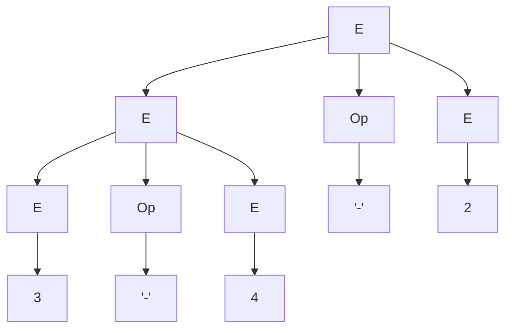
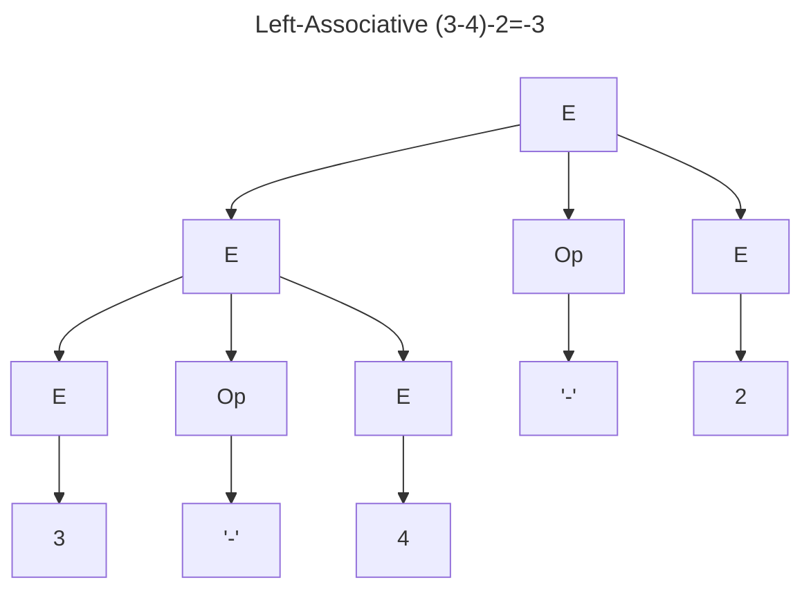
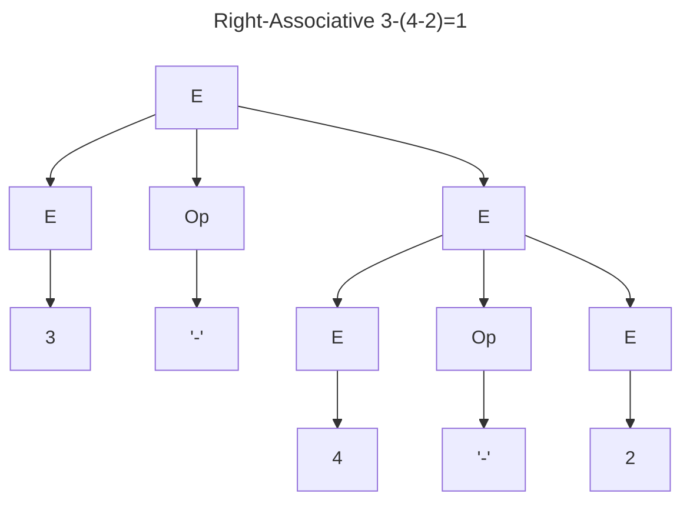
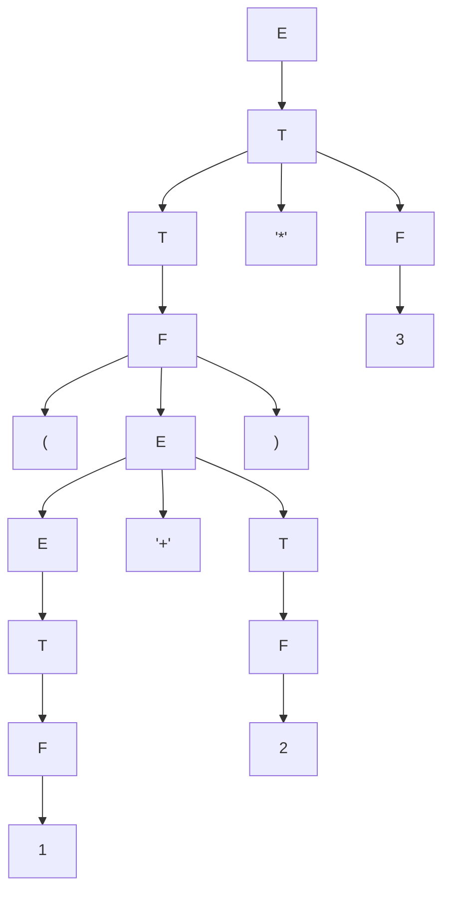

# Grammars, and Syntax Foundations

## Context-free Grammar

A context-free Grammar consists of:

- A finite set, $\Sigma$, of terminal symbols
- A finite nonempty set of non-terminal symbols (disjoint from the terminal symbols)
- A finite nonempty set of productions of the form $A \rightarrow \alpha$, where $A$ is a non-terminal symbol, and $\alpha$ is a possibly empty sequence of symbols, each of which is either a terminal or non-terminal symbol.
- A start symbol that must be a non-terminal symbol

> [!note] Example
> The context-free grammar
>
> ```haskell
> E -> E Op E
> E -> "(" E ")"
> E -> number
> Op -> "+"
> Op -> "-"
> Op -> "*"
> ```
>
> has:
>
> - start symbol $\texttt{E}$
> - terminals $\{\texttt{"("}, \texttt{")"}, \texttt{number}, \texttt{"+"}, \texttt{"-"}, \texttt{"*"}\}$
> - non-terminals $\{\texttt{E}, \texttt{Op}\}$

### Derivation Sequences

#### Directly Derives

if $N \to \gamma$ is a production, then in any sequence $\alpha\;N\;\beta$, we can replace $N$ with $\gamma$ to obtain $\alpha\;\gamma\;\beta$, written as:

$$
\alpha\;N\;\beta \Rightarrow \alpha \gamma \beta
$$

#### Derives

We say that a sequence of terminal and non-terminal symbols $\alpha$ **derives** a sequence $\beta$, written

$$
\alpha \overset{*}{\Rightarrow} \beta
$$

if $\beta$ can be obtained from $\alpha$ by applying zero or more direct derivation steps. Equivalently, there exists a finite sequence

$$
\gamma_0, \gamma_1, \gamma_2, \dots, \gamma_n
$$

such that

$$
\alpha = \gamma_0 \Rightarrow \gamma_1 \Rightarrow \cdots \Rightarrow \gamma_n = \beta
$$

Because zero steps are allowed, every sequence derives itself:

$$
\alpha \overset{*}{\Rightarrow} \alpha
$$

#### Nullable

A nullable sequence is written as:

$$
\begin{aligned}
	\alpha &\overset{*}{\Rightarrow} \epsilon \\
	\alpha &\overset{*}{\Rightarrow}
\end{aligned}
$$

Some rules for nullable:

- $\epsilon$ is nullable
- any terminal symbol is **not** nullable
- a sequence of the form $S_1\;S_2\;\cdots\;S_n$ is nullable if all of the constructs $S_1,\cdots,S_n$ are nullable
- a set of alternatives $S_1\mid\cdots\mid S_n$ is nullable if at least one of the alternatives is nullable
- EBNF constructs for optionals and repetition are nullable
- a non-terminal $N$ is nullable if there is a production $N$ with a nullable right side

### Language

The **language** $\mathcal{L}(G)$ of a grammar $G$ is the set of all finite sequences of terminal symbols that can be derived from the start symbol using the grammar's productions:

$$
\mathcal{L}(G) = \{t \in \mathrm{seq}\,\Sigma\mid S\overset{*}{\Rightarrow}t\}
$$

where $S$ is the start symbol and $\Sigma$ is the set of terminal symbols.

#### Sentence

A **sentence** is a sequence of terminal symbols t such that

$$
S\overset{*}{\Rightarrow}t
$$

#### Sentential Form

A **sentential form** is a sequence of terminal and non-terminal symbols $\alpha$ such that

$$
S\overset{*}{\Rightarrow}\alpha
$$

> [!note]
> hence, All sentences are also sentential forms

## Parse trees

A derivation of a sentence determines a corresponding **parse tree**.

- Each direct derivation step using a production $N \to \alpha$ adds a subtree with root $N$ and children given by the symbols in $\alpha$.
- By applying the derivation steps in sequence, the full parse tree is built.

    > [!note]
    > Different derivation sequences can produce the same parse tree, because the nonterminals may be expanded in different orders.

### Example

```haskell
E -> E Op E |“(” E “)” | number
Op -> “+” |“-” |“*”
```



### Ambiguous grammar

| **Definition**               | **Meaning**                                                                                                      |
| ---------------------------- | ---------------------------------------------------------------------------------------------------------------- |
| **Ambiguous for a sentence** | A grammar G is ambiguous for a sentence t \in L(G) if t has more than one parse tree.                            |
| **Ambiguous grammar**        | A grammar G is ambiguous if there exists some sentence t \in L(G) for which G produces more than one parse tree. |

**Example**

```haskell
E -> E Op E |“(” E “)” | number
Op -> “+” |“-” |“*”
```





### Left and right associative operators

| Left-associative                                                                | Right-associative                                                                   |
| ------------------------------------------------------------------------------- | ----------------------------------------------------------------------------------- |
| $$\begin{aligned}E &\to E\ \texttt{"-"}\ T \\E &\to T \\ T&\to N\end{aligned}$$ | $$\begin{aligned} E &\to T\ \texttt{"-"}\ E \\ E &\to T \\ T &\to N \end{aligned}$$ |
| Groups subtraction from the left, so 3 - 4 - 2 is parsed as (3 - 4) - 2.        | Groups subtraction from the right, so 3 - 4 - 2 is parsed as 3 - (4 - 2).           |

### Operator Precedence

With the grammar

```haskell
E -> E "+" E
E -> E "*" E
E -> N
```

operator precedence is not enforced. As a result, the sentence $1+2*3$ is ambiguous: it can be parsed as either $1+(2*3)$ or $(1+2)*3$.

To give \* higher precedence than + and remove this ambiguity, we rewrite the grammar as

```haskell
E -> E "+" T | T
T -> T "*" F | F
F -> N
```

In this grammar, multiplication binds more tightly than addition, and both operators are left-associative.

#### Overriding Operator Precedence



### CFG stuff

## Chomsky Hierarchy of Grammars

Non-terminal symbols are written in uppercase, terminal symbols in lowercase, Greek letters denote possibly empty sequences of terminals and nonterminals, and $\epsilon$ denotes the empty sequence.

| Type | Name              | Example                                      | Equivalent model          |
| ---- | ----------------- | -------------------------------------------- | ------------------------- |
| 3    | Left/right Linear | $A \to \epsilon$, $A \to a\;B$, $A \to a$    | Finite automaton, regex   |
| 2    | Context-free      | $A \to \alpha$                               | Pushdown automaton        |
| 1    | Context-sensitive | $\beta\;A\;\gamma \to \beta\;\alpha\;\gamma$ | Context-sensitive grammar |
| 0    | Unrestricted      | $\alpha \to \beta \; (\alpha \neq \epsilon)$ | Turing machine equivalent |
