# Tutorial 1

```pascal
var
x: int; y: int; max: int;
begin
read x; read y;
if x < y then
    max := y
else
	max := x;
write max
end
```

## Q1.
### (a)
```sequence-token
KW_VAR,
IDENTIFIER("x") COLON IDENTIFIER("int") SEMICOLON IDENTIFIER("y") COLON IDENTIFIER("int") SEMICOLON IDENTIFIER("max") COLON IDENTIFIER("int")
KW_BEGIN
KW_READ IDENTIFIER("x") SEMICOLON KW_READ IDENTIFIER("y") SEMICOLON
KW_IF IDENTIFIER("x") LESS IDENTIFIER("y") KW_THEN
IDENTIFIER("max") ASSIGN IDENTIFIER("y")
KW_ELSE
IDENTIFIER("max") ASSIGN IDENTIFIER("x")
KW_WRITE IDENTIFIER("max")
KW_END
EOF
```

### (b)

```mermaid
graph TD

S[Statement] --> VDL[VarDeclList]
S --> C[CompoundStatement]

%% -- Variable Declaration List -- %%
VDL --> KVar[KW_VAR]
VDL --> VDx[VarDecl]
VDL --> VDy[VarDecl]
VDL --> VDmax[VarDecl]

%% Variable X %%
VDx --> IDx["IDENTIFIER(x)"]
VDx --> COLx[COLON]
VDx --> Typex[TypeIdentifier]
Typex --> TypeIdentifierx["IDENTIFIER(int)"]
VDx --> SEMIx[SEMICOLON]

%% Variable Y %%
VDy --> IDy["IDENTIFIER(y)"]
VDy --> COLy[COLON]
VDy --> Typey[TypeIdentifier]
Typey --> TypeIdentifiery["IDENTIFIER(int)"]
VDy --> SEMIy[SEMICOLON]

%% Variable Max %%
VDmax --> IDmax["IDENTIFIER(max)"]
VDmax --> COLmax[COLON]
VDmax --> Typemax[TypeIdentifier]
Typemax --> TypeIdentifiermax["IDENTIFIER(int)"]
VDmax --> SEMImax[SEMICOLON]

%% -- Compound Statement -- %%
C --> KW_BEGIN
C --> Csl[StatementList]
C --> KW_END

%% Statement List %%
Csl --> Readx[ReadStatement]
Csl --> Ready[ReadStatement]
Csl --> Writex[WriteStatement]
Csl --> Writey[WriteStatement]
Csl --> IfStatement

%% Read Statements %%
Readx --> Krx[KW_READ]
Readx --> LVrx[LValue]
LVrx --> IDrx["IDENTIFIER(x)"]

Ready --> Kry[KW_READ]
Ready --> LVry[LValue]
LVry --> IDry["IDENTIFIER(y)"]

%% If Statement %%
IfStatement --> KW_IF
IfStatement --> relCond[Condition]
IfStatement --> KW_THEN
IfStatement --> if[Statement]
IfStatement --> KW_ELSE
IfStatement --> else[Statement]

%% == Sub If Childs == %%
relCond --> RelCondition

RelCondition --> Expx[Exp]
RelCondition --> RelOp
RelCondition --> Expy[Exp]

Expx --> Termx[Term]
Termx --> Factorx[Factor]
Factorx --> LVcex[LValue]
LVcex --> IDcex["IDENTIFIER(x)"]

RelOp --> LESS
Expy --> Termy[Term]
Termy --> Factory[Factor]
Factory --> LVcey[LValue]
LVcey --> IDcey["IDENTIFIER(y)"]

%% =- If -= %%
if --> LVi[LValue]
if --> i[ASSIGN]
LVi --> IDi["IDENTIFIER(max)"]
if --> RelConx[RelCondition]

RelConx --> Expmaxx[Exp]
Expmaxx --> Termax[Term]
Termax --> Factorax[Factor]
Factorax --> LVax[LValue]
LVax --> IDax["IDENTIFIER(y)"]

%% =- Else -= %%
else --> LVe[LValue]
else --> e[ASSIGN]
LVe --> IDe["IDENTIFIER(max)"]
else --> RelCony[RelCondition]

RelCony --> Expmaxy[Exp]
Expmaxy --> Termaxy[Term]
Termaxy --> Factoray[Factor]
Factoray --> LVay[LValue]
LVay --> IDay["IDENTIFIER(x)"]

%% Write Statements %%
Writex --> Kwx[KW_READ]
Writex --> LVwx[LValue]
LVwx --> IDwx["IDENTIFIER(x)"]

Writey --> Kwy[KW_READ]
Writey --> LVwy[LValue]
LVwy --> IDwy["IDENTIFIER(y)"]
```
