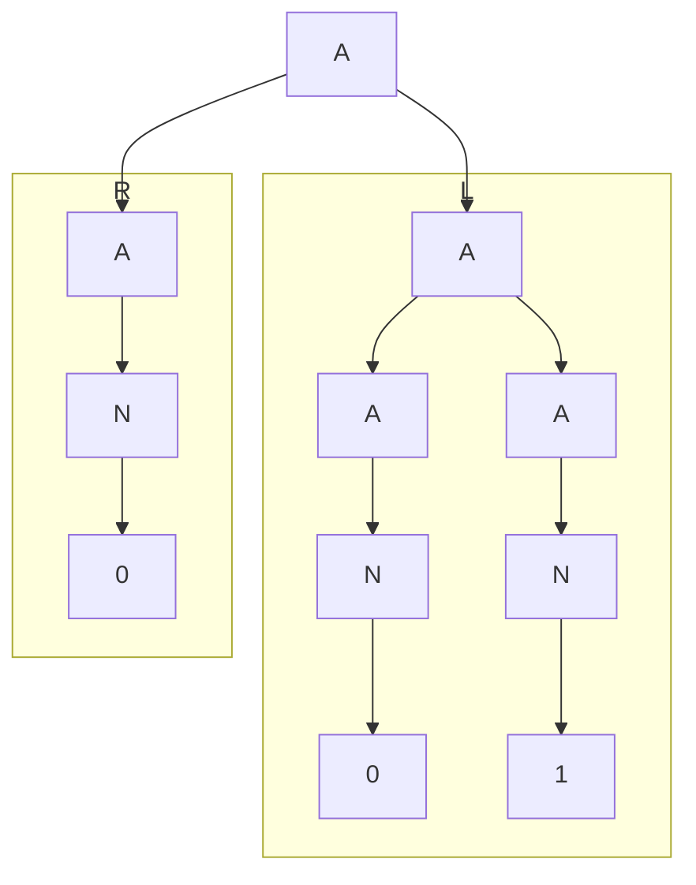
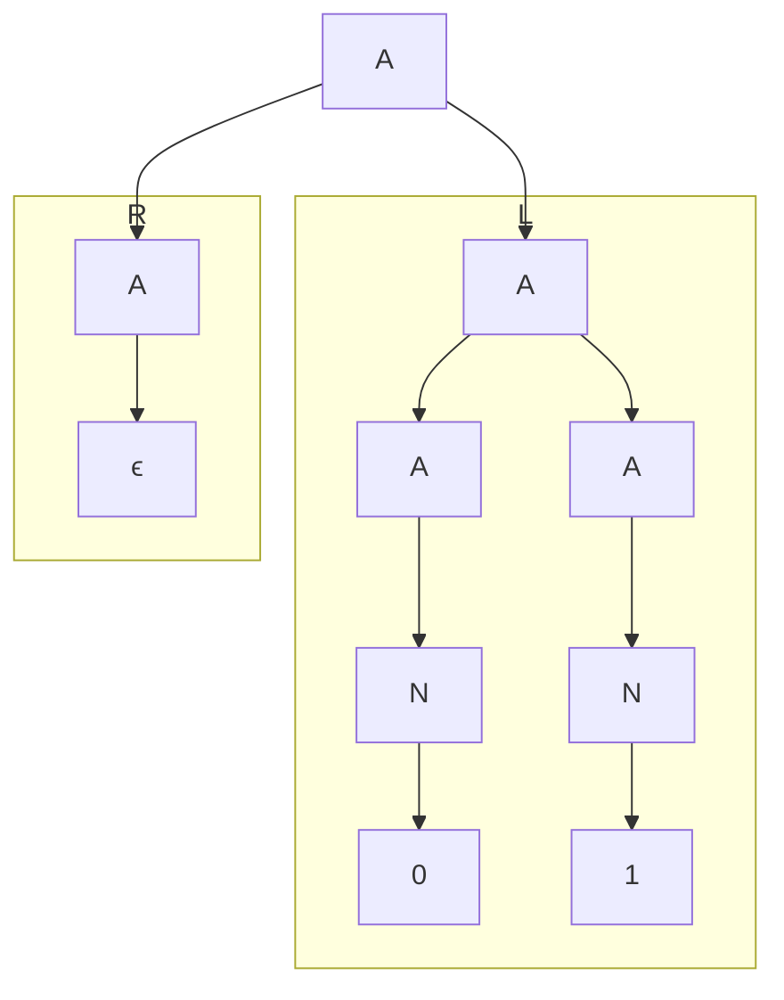
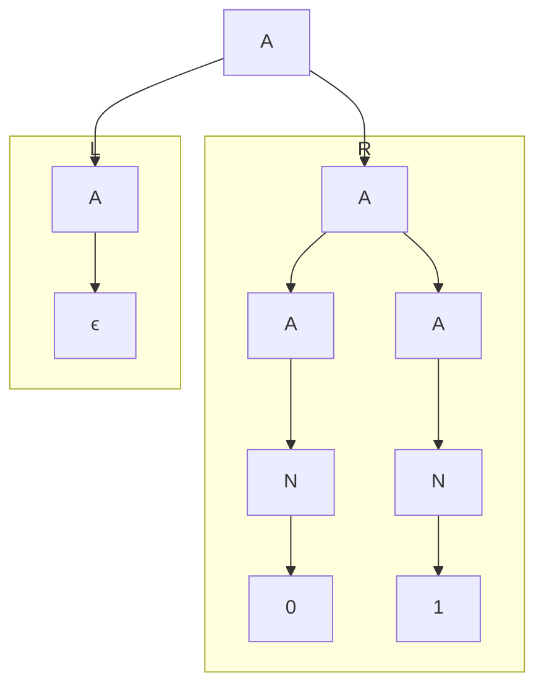
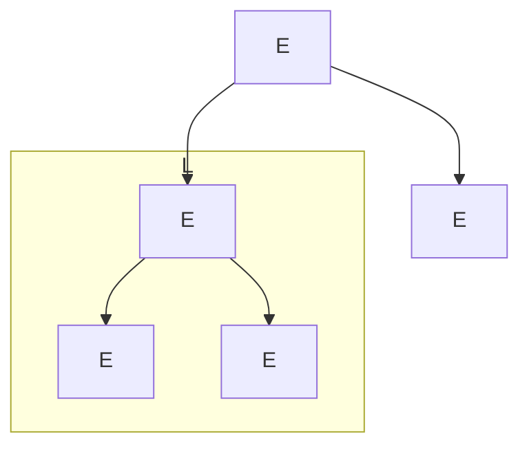
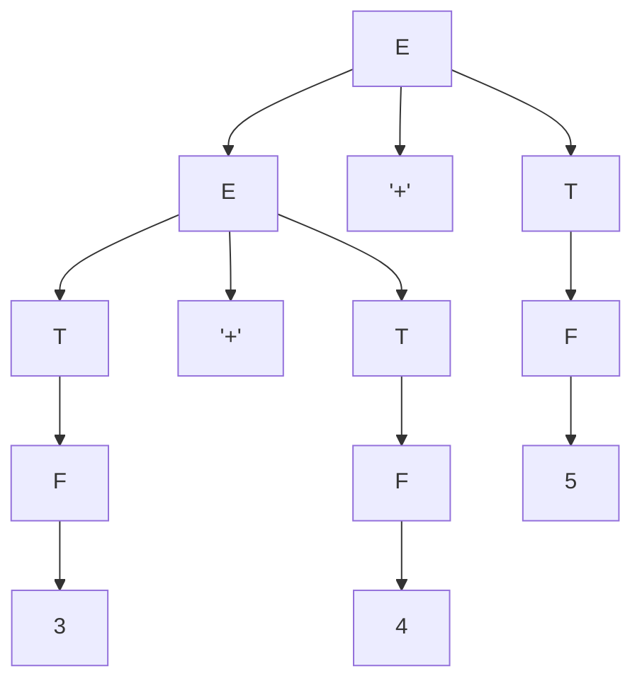
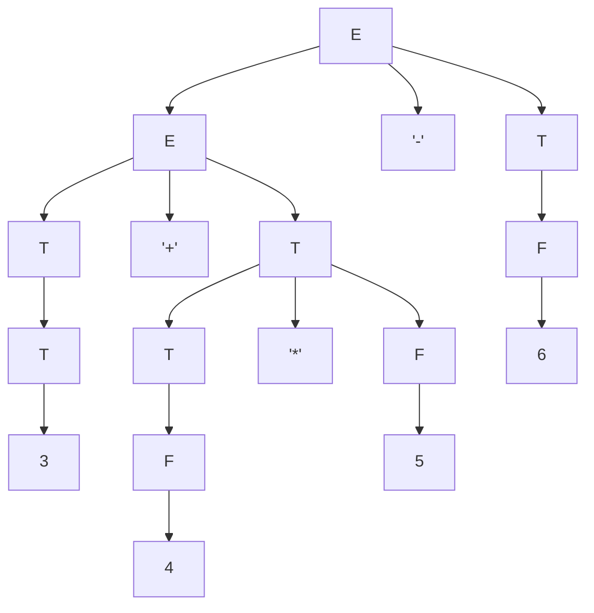
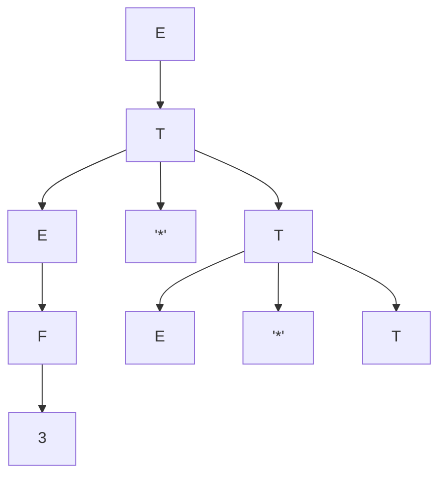

# Tutorial 2

## Q1
### a.
#### i.
```haskell
A -> A “:” N | N
N -> 0 | 1
```
##### Language
All strings are of the form
$$
L = \{\,b_1:b_2\cdots:b_k \mid k \ge 1,\; b_i \in \{0,1\}\,\}

$$
##### Equivalent Regex
```regex
(0|1)(:(0|1))*
```
#### ii.
```haskell
A -> A N | ϵ
N -> 0 | 1
```
##### Language
All strings are of the form
$$
L = \{\; w \mid w \in \{0,1\}^*\;\}
$$
##### Equivalent Regex
```regex
(0|1)*
```
#### iii.
```haskell
A -> A A | N
N -> 0 | 1
```
##### Language
All strings are of the form
$$
L=\{\; w \mid w \in \{0,1\}^+ \;\}
$$
##### Equivalent Regex
```regex
(0|1)+
```
#### iv.
```haskell
A -> A N | N | ϵ
N -> 0 | 1
```
##### Language
All strings are of the form
$$
L=\{\; w \mid w \in \{0,1\}^* \;\}
$$
##### Equivalent Regex
```regex
(0|1)*
```

### b.
#### i. It has a fixed separator ":"
#### ii. it applies the same operation for any length input
#### iii.
Left Tree

Right Tree

#### iv.
Left Tree

Right Tree



## Q2
### a.
```haskell
A -> A A | "(" A ")" | ϵ
```
##### Language
All strings are of the form
$$
L=\{\; w \mid w \in \{(,)\}^* \text{ and } w \text{ is balanced} \;\}  
$$
##### Equivalent Regex
```regex
^(?:\((?R)*\))*$
```
### b.
Left Tree


Right Tree


## Q3
### a.

### b.

### c.

### d.


### Q4

## Notes
`*` means Kleene star which is zero or more repetition
`+` means Kleene plus which is one or more repetition

